# 📄 MOCS Challenge - OCR & Análise de Documentos com IA

Sistema de análise de documentos com OCR (Reconhecimento Óptico de Caracteres) e chat com IA para responder perguntas sobre o conteúdo extraído.

## 🎯 Descrição

Esta aplicação permite:
- **Fazer upload de documentos** (PDF, imagens JPG/PNG)
- **Extrair texto** automaticamente usando OCR
- **Fazer perguntas** sobre o conteúdo com IA (Google Gemini)
- **Obter respostas** contextualizadas baseadas no documento

## 🏗️ Arquitetura do Sistema


## 🔄 Fluxo de Processamento

```mermaid
sequenceDiagram
    participant U as Usuário
    participant F as Frontend
    participant B as Backend
    participant OCR as OCR Engine
    participant DB as PostgreSQL
    participant AI as Google Gemini
    
    Note over U,AI: Upload e Processamento de Documento
    U->>F: 1. Faz upload do documento (PDF/imagem)
    F->>B: 2. POST /api/documents/upload
    B->>OCR: 3. Extrai texto do documento
    OCR-->>B: 4. Texto extraído
    B->>DB: 5. Salva documento e texto
    DB-->>B: 6. Confirmação
    B-->>F: 7. Documento processado
    F-->>U: 8. Mostra texto extraído
    
    Note over U,AI: Chat com IA
    U->>F: 9. Faz pergunta sobre documento
    F->>B: 10. POST /api/documents/:id/question
    B->>DB: 11. Obtém texto do documento
    DB-->>B: 12. Texto completo
    B->>AI: 13. Envia pergunta + contexto
    AI-->>B: 14. Resposta gerada
    B-->>F: 15. Resposta JSON
    F-->>U: 16. Mostra resposta
```



## 🛠️ Stack Tecnológico

### Backend
- **Node.js 22** - Runtime JavaScript
- **Fastify** - Framework web de alta performance
- **TypeScript** - Tipagem estática
- **PostgreSQL** - Banco de dados
- **Tesseract.js** - OCR para imagens
- **pdf-parse** - Extração de texto de PDFs
- **Google Gemini API** - IA para chat
- **pnpm** - Gerenciador de pacotes

### Frontend
- **React 19** - Biblioteca UI
- **TypeScript** - Tipagem estática
- **Vite** - Build tool
- **Tailwind CSS** - Framework CSS
- **shadcn/ui** - Componentes UI
- **Axios** - Cliente HTTP

### Infraestrutura
- **Docker & Docker Compose** - Containerização
- **PostgreSQL 15** - Banco de dados

## 📁 Estrutura do Projeto

```
MOCS-challenge/
├── backend/                    # API Node.js
│   ├── src/
│   │   ├── controllers/        # Controladores HTTP
│   │   ├── services/          # Lógica de negócio
│   │   │   ├── chat.service.ts       # Google Gemini
│   │   │   ├── documents.service.ts  # CRUD documentos
│   │   │   ├── textExtractor.service.ts # OCR
│   │   │   ├── database.ts           # PostgreSQL
│   │   │   └── logger.ts             # Logging
│   │   ├── routes/            # Rotas da API
│   │   ├── types/             # Tipos TypeScript
│   │   └── index.ts           # Entry point
│   ├── Dockerfile
│   └── package.json
│
├── frontend/                   # App React
│   ├── src/
│   │   ├── components/        # Componentes React
│   │   │   ├── DocumentUpload.tsx
│   │   │   ├── DocumentView.tsx
│   │   │   └── QuestionChat.tsx
│   │   ├── services/          # Clientes da API
│   │   ├── types/             # Tipos TypeScript
│   │   └── App.tsx
│   ├── Dockerfile
│   └── package.json
│
├── database/
│   └── init.sql               # Schema inicial
│
├── compose.yml                # Docker Compose
├── .env.example              # Variáveis de ambiente
└── README.md                 # Este arquivo
```

## 🚀 Instalação e Execução

### Pré-requisitos

- **Docker** e **Docker Compose** (recomendado)
- Ou **Node.js 22+** e **PostgreSQL** para desenvolvimento local

### Opção 1: Docker (Recomendado)

```bash
# 1. Clonar repositório
git clone <repository-url>
cd MOCS-challenge

# 2. Configurar variáveis de ambiente
cp .env.example .env
# Editar .env e adicionar sua GOOGLE_API_KEY

# 3. Subir todos os serviços
docker compose up --build

# 4. Acessar a aplicação
# Frontend: http://localhost:5173
# Backend: http://localhost:3001
# Banco de dados: localhost:5432
```

### Opção 2: Desenvolvimento Local

#### Backend
```bash
cd backend

# Instalar dependências
pnpm install

# Configurar banco de dados PostgreSQL
createdb mocs_db

# Executar migrações
psql -d mocs_db -f ../database/init.sql

# Iniciar em modo desenvolvimento
pnpm dev
```

#### Frontend
```bash
cd frontend

# Instalar dependências
pnpm install

# Iniciar em modo desenvolvimento
pnpm dev
```

## 🔧 Configuração

### Variáveis de Ambiente

Criar arquivo `.env` baseado no `.env.example`:

```bash
# Banco de dados
POSTGRES_USER=mocs_user
POSTGRES_PASSWORD=mocs_password
POSTGRES_DB=mocs_db
DATABASE_URL=postgresql://mocs_user:mocs_password@db:5432/mocs_db

# Backend
NODE_ENV=development
PORT=3001

# Google Gemini API
GOOGLE_API_KEY=sua-api-key-aqui

# Frontend
VITE_API_URL=http://localhost:3001
```

### Obter Google API Key

1. Ir para [Google AI Studio](https://makersuite.google.com/app/apikey)
2. Criar uma nova API key
3. Copiar a key para o arquivo `.env`

## 📖 Uso da Aplicação

### Fluxo da Aplicação

A aplicação funciona em um fluxo simples de 3 etapas:


### 1. Upload de Documento

1. Abrir http://localhost:5173
2. Clicar em "Choose File" ou arrastar arquivo
3. Selecionar PDF ou imagem (JPG, PNG)
4. Clicar em "Upload and Process"
5. Aguardar o processamento do OCR

### 2. Visualizar Documento

- O texto extraído é mostrado automaticamente
- É possível revisar a qualidade da extração
- O documento fica disponível para fazer perguntas

### 3. Chat com IA

1. Clicar em "Chat" na navegação
2. Escrever pergunta sobre o documento
3. Exemplos:
   - "Qual é o valor total?"
   - "Quem são as partes do contrato?"
   - "Resuma o documento em 3 pontos"
4. A IA responde baseada no conteúdo extraído

**Nota:** A aplicação trabalha com um documento por vez. Para processar outro documento, faça um novo upload.

## 🔌 API Endpoints

### Documentos

#### `POST /api/documents/upload`
Faz upload e processa um documento.

**Request:**
- Content-Type: `multipart/form-data`
- Body: `file` (PDF ou imagem)

**Response:**
```json
{
  "id": "uuid",
  "fileName": "documento.pdf",
  "textContent": "Texto extraído...",
  "createdAt": "2025-01-03T00:00:00.000Z"
}
```

#### `POST /api/documents/question`
Faz uma pergunta sobre um documento.

**Request:**
```json
{
  "documentId": "uuid",
  "question": "Qual é o valor total?"
}
```

**Response:**
```json
{
  "answer": "O valor total é R$ 10.000,00"
}
```

### Health Check

#### `GET /health`
Verifica o status do serviço.

## 🐳 Docker

### Serviços

O `compose.yml` define 3 serviços:


### Comandos Úteis

```bash
# Subir serviços
docker compose up -d

# Ver logs
docker compose logs -f backend
docker compose logs -f frontend

# Reconstruir imagens
docker compose build

# Parar serviços
docker compose down

# Limpar volumes
docker compose down -v
```

## 🔍 Desenvolvimento

### Scripts Disponíveis

#### Backend
```bash
pnpm dev          # Modo desenvolvimento com hot reload
pnpm build        # Compilar TypeScript
pnpm start        # Executar versão compilada
pnpm lint         # Linter ESLint
pnpm type-check   # Verificar tipos
```

#### Frontend
```bash
pnpm dev          # Servidor de desenvolvimento
pnpm build        # Build de produção
pnpm preview      # Preview do build
pnpm lint         # Linter ESLint
```

### Estrutura do Banco de Dados

```sql
-- Tabela principal de documentos
CREATE TABLE documents (
    id UUID PRIMARY KEY DEFAULT gen_random_uuid(),
    file_name VARCHAR(255) NOT NULL,
    text_content TEXT,
    created_at TIMESTAMP DEFAULT CURRENT_TIMESTAMP
);
```

## 📝 Notas Técnicas

### OCR Engine
- **PDFs**: Usa `pdf-parse` para extrair texto nativo
- **Imagens**: Usa `Tesseract.js` com modelos em inglês e português
- **Qualidade**: Depende da resolução e clareza do documento

### IA Chat
- **Modelo**: Google Gemini Pro
- **Contexto**: Envia o texto completo do documento
- **Limites**: Respeita os limites de tokens da API

### Performance
- **Upload**: Limite de 10MB por arquivo
- **OCR**: Processamento assíncrono
- **Banco de dados**: Índices em campos de busca

---

**Desenvolvido para o Desafio MOCS - Desenvolvedor Full Stack Pleno**
